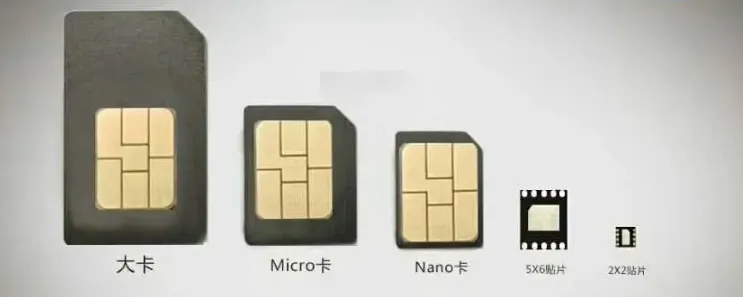

## 一、术语、定义和缩略语介绍

| 名词 | 解释 | 
|:------: |:-------|
| 2FF |  Second format of UICC（通用集成电路卡的第二种规格。指的是标准卡，尺寸为25MM*15MM） |
|  3FF | Third format of UICC（通用集成电路卡的第三种规格。指的是Micro卡，尺寸为15MM*12MM） | 
|  4FF   | Fourth format of UICC（通用集成电路卡的第四种规格。指的是Nano卡，尺寸为12.3MM*8.8MM） | 
| APDU  | Application Protocol Data Unit 应用协议数据单元   | 
|  M2M   | Machine to Machine 机器对机器（是一种信息传输技术，传感器遥测就是这项技术的用途之一） | 
| MP卡   | M2M Plug-in卡的简称，插拔式物联卡（这种卡的使用方式和手机卡的使用方式一致。根据材质不同，通常将这类卡分为MP1卡和MP2卡） | 
| MS卡 | M2M SMD卡的简称（采用SMD贴片封装工艺使得用户卡的芯片可 以直接焊接在模组上或终端内部，根据材质不同，通常将这类卡分为MS0卡和MS1卡） | 
| OTA   | Over The Air 空中传输协议   | 
|  QFN   | Quad Flat No-lead Package 方形扁平无引脚封装 | 
| SIM   | Subscriber Identity Module 用户识别模块  | 
|  SMD  | Surface Mounted Devices 表面贴装器件  | 
|  SMS | Short Message Service 短消息服务   | 
| STK | SIM Toolkit SIM卡应用交互机卡协议  | 
|  SWP   | Single Wire Protocol 单线全双工数据传输技术  | 
|   UICC   | Universal Integrated Circuit Card，通用集成电路卡    | 
|  USIM   | Universal Subscriber Identity Module 通用用户识别模块  | 
|  载带   | 指卡正面的金属贴片部分，其主要提供卡的外部触点以实现卡 芯片与终端的物理连接，同时对卡的芯片起到支承和保护作用    | 
|

## 二、物联网卡分类概述
### 1、按照应用场景
物联网卡指的是应用于物联网的卡，具备普通级和工业级两类级别，普通级物联网卡的物料特性与普通的USIM卡基本一直，工业级物联网卡其在抵抗高低温、高湿度、擦写次数等方面有独特的优势，能够满足特殊环境的要求。如：外观尺寸、操作和存储温度、湿度、振动、擦写次数、卡的翘曲、耐化学性、紫外线、抗静电、X射线、成本、防盗用性等。

### 2、按照使用方法
#### 2.1 插拔式物联网卡（MP卡）
插拔式物联网卡，硬件设备有卡槽，用户在使用期间可直接将卡插入或取出。在成本方面是比较划算的，安装和使用都比较方便。
#### 2.2 切片式物联网卡（MS卡）
切片式物联网卡也称焊接式物联网卡。切片式物联网卡相比于插拔式卡，通过焊接工艺将卡焊接在模组或终端内部，以实现紧急牢固的物理连接；尺寸较小，具有较高的抗振动性。
#### 2.3 eSIM（切片式转插拔式物联网卡）
目前小范围推广使用。设备前期只需要具备支持ESIM物联卡芯片的通讯模组或者独立的ESIM芯片即可，后期将物联网卡号码通过远程空中写号（OTA）的方式写入eSIM芯片即可实现卡号的实时分配。

## 3、按照材质划分
### 3.1 插拔式物联网卡分为：MP1、MP2
**MP1为普通级物联网卡**，又称“消费级物联网卡”，有带语音和不带语音两种模式，分为三切卡、双切卡、大卡；使用设备场景一般为远程抄表、消费电子，智能家居，智能穿戴、智能门禁。

**MP2为工业级物联网卡**，又称“工业级物联网卡”，不带语音功能，分为三切卡、双切卡、大卡；使用设备场景一般为污水处理、泵房、智慧气站、发电站等。

## 4、按照尺寸划分

根据卡尺寸不同，可以分为：
- 大卡、
- Micro SIM卡 中卡
- Naro SIM卡 小卡
- QFN 贴片卡

三切卡则为同时支持了大卡、Micro SIM 卡，Nano SIM 卡。 双切卡则为同时支持了大卡、Micro SIM 卡。

**注意事项**

简单的说，三切卡支持所有SIM卡槽，任何带有卡槽的终端或智能设备都可以使用。这一点要特别注意，之前我们去运营商拿卡，回来发现是来两切卡，我们的卡槽是Nano卡槽，最终到运营商重新开户申请，主要是浪费时间，影响设备交期。
